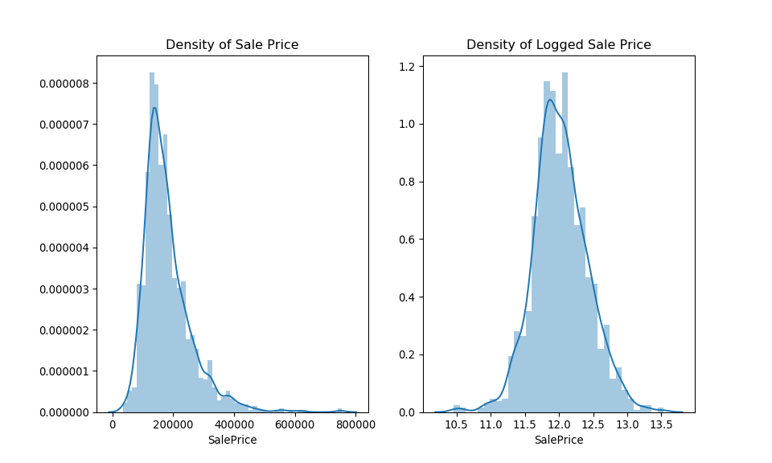

# Introduction

R and Python are both great for statistical programming, but have their relative strengths and weaknesses. I will sum these differences up, poorly, as: R is generally better at inferential statistics, Python is generally better at predictive statistics--and machine learning more specifically. As a summary statement and generalization, that is both helpful and wrong. But gives the general idea.

I thought it would be fun, as an exercise, to do a side-by-side, nose-to-tail analysis in both R and Python, taking advantage of the wonderful [`{reticulate}`](https://rstudio.github.io/reticulate/) package in R. `{reticulate}` allows one to access Python through the R interface. I find this especially cool in Rmarkdown, since you can knit R and Python chucks in the same document! You can, to some extent, pass objects back and forth between the R and Python environments. Wow. 

So given this affordance, I analyze the Ames Housing dataset with the goal of predicting housing prices, a la [this Kaggle competition](https://www.kaggle.com/c/house-prices-advanced-regression-techniques).

I abide by a few rule:

- Be explicit as possible in both languages
- Use a few packages/libraries as possible
- Level playing field--e.g., use the same values for tuning parameters
- Try to replicate the analysis as closely as possible in each language
- Avoid any sort of evaluative comparison

_Important note._ I primarily use R and have much more experience with R than Python. So bear that in mind.

Let the fun begin.


# Importing the libraries

Now, I know I just said that I will use as few libraries as possible--but I will do the R end of this in the `{tidyverse}` idiom. I will also take a few things from the `{tidymodels}` suite of packages. I do this because `{tidymodels}` is the successor to one of the main machine learning packages in R, `{caret}`.


For Python, I use the usual suspects: `{pandas}`, `{numpy}` and `{scipy}`, and `{matplotlib}` for visualizations. I also import `{seaborn}`, again violating my rules, but `{seaborn}` makes it easy to color visualizations by groups, like in `{ggplot2}`.

```python
import pandas as pd
import numpy as np
from scipy.stats import skew
import seaborn as sns
import matplotlib.pyplot as plt
```

## Importing the data

The cool thing about `{reticulate}` is that it allows you to access objects from either environment. To access a Python object, you use the syntax `r.object` and in R you use `py$object`. So in this case, I will import using Python and then call the objects over to the R environment. 
This causes an interesting data issue and serves as a good reminder to always check out your data before plunging ahead with analysis. 

```python
train = pd.read_csv('train.csv')
test = pd.read_csv('test.csv')

# Keep the IDs from the test data for submission
ids = test['Id']
```

Using the syntax just described, I will assign the objects in R.

```r
train <- py$train
test <- py$test

# Keep IDs for submission
ids <- test %>% pull(Id)
test <- test %>% select(-Id)

# Keep outcome variable
y <- train$SalePrice
```

# Exploratory data analysis

## Examining the structure of the data

First, it is always a good idea to know exactly _what_ the data look like. Key questions:

1. How many variables/features/columns do I have?
2. How many observations/rows do I have?
3. What types of variables/features/columns do I have?
4. Which variables/features/columns have missing observations and how many?

Let's do this in R first. Check the dimensions and then the features. 

```r
print(glue("The training dataset has {ncol(train)} features and {nrow(train)} observations."))
```

```
## The training dataset has 81 features and 1460 observations.
```

```r
map_chr(train, class) %>% table() %>% {glue("There are {.} features of type {names(.)}")}
```

```
## There are 27 features of type character
## There are 16 features of type list
## There are 38 features of type numeric
```

I like the `glimpse()` function from the `{tibble}` package a lot--it gives the dimension, the features, their type, and a quick glance at each. But it isn't great where there are a great deal of features. So, check the dimensions first. Here, it's not bad at all, so I use `glimpse()` to see the features and their type.

```r
glimpse(train)
```

```
## Observations: 1,460
## Variables: 81
## $ Id            <dbl> 1, 2, 3, 4, 5, 6, 7, 8, 9, 10, 11, 12, 13, 14, 15,…
## $ MSSubClass    <dbl> 60, 20, 60, 70, 60, 50, 20, 60, 50, 190, 20, 60, 2…
## $ MSZoning      <chr> "RL", "RL", "RL", "RL", "RL", "RL", "RL", "RL", "R…
## $ LotFrontage   <dbl> 65, 80, 68, 60, 84, 85, 75, NaN, 51, 50, 70, 85, N…
## $ LotArea       <dbl> 8450, 9600, 11250, 9550, 14260, 14115, 10084, 1038…
## $ Street        <chr> "Pave", "Pave", "Pave", "Pave", "Pave", "Pave", "P…
## $ Alley         <list> [NaN, NaN, NaN, NaN, NaN, NaN, NaN, NaN, NaN, NaN…
## $ LotShape      <chr> "Reg", "Reg", "IR1", "IR1", "IR1", "IR1", "Reg", "…
## $ LandContour   <chr> "Lvl", "Lvl", "Lvl", "Lvl", "Lvl", "Lvl", "Lvl", "…
## $ Utilities     <chr> "AllPub", "AllPub", "AllPub", "AllPub", "AllPub", …
## $ LotConfig     <chr> "Inside", "FR2", "Inside", "Corner", "FR2", "Insid…
## $ LandSlope     <chr> "Gtl", "Gtl", "Gtl", "Gtl", "Gtl", "Gtl", "Gtl", "…
## $ Neighborhood  <chr> "CollgCr", "Veenker", "CollgCr", "Crawfor", "NoRid…
## $ Condition1    <chr> "Norm", "Feedr", "Norm", "Norm", "Norm", "Norm", "…
## $ Condition2    <chr> "Norm", "Norm", "Norm", "Norm", "Norm", "Norm", "N…
## $ BldgType      <chr> "1Fam", "1Fam", "1Fam", "1Fam", "1Fam", "1Fam", "1…
## $ HouseStyle    <chr> "2Story", "1Story", "2Story", "2Story", "2Story", …
## $ OverallQual   <dbl> 7, 6, 7, 7, 8, 5, 8, 7, 7, 5, 5, 9, 5, 7, 6, 7, 6,…
## $ OverallCond   <dbl> 5, 8, 5, 5, 5, 5, 5, 6, 5, 6, 5, 5, 6, 5, 5, 8, 7,…
## $ YearBuilt     <dbl> 2003, 1976, 2001, 1915, 2000, 1993, 2004, 1973, 19…
## $ YearRemodAdd  <dbl> 2003, 1976, 2002, 1970, 2000, 1995, 2005, 1973, 19…
## $ RoofStyle     <chr> "Gable", "Gable", "Gable", "Gable", "Gable", "Gabl…
## $ RoofMatl      <chr> "CompShg", "CompShg", "CompShg", "CompShg", "CompS…
## $ Exterior1st   <chr> "VinylSd", "MetalSd", "VinylSd", "Wd Sdng", "Vinyl…
## $ Exterior2nd   <chr> "VinylSd", "MetalSd", "VinylSd", "Wd Shng", "Vinyl…
## $ MasVnrType    <list> ["BrkFace", "None", "BrkFace", "None", "BrkFace",…
## $ MasVnrArea    <dbl> 196, 0, 162, 0, 350, 0, 186, 240, 0, 0, 0, 286, 0,…
## $ ExterQual     <chr> "Gd", "TA", "Gd", "TA", "Gd", "TA", "Gd", "TA", "T…
## $ ExterCond     <chr> "TA", "TA", "TA", "TA", "TA", "TA", "TA", "TA", "T…
## $ Foundation    <chr> "PConc", "CBlock", "PConc", "BrkTil", "PConc", "Wo…
## $ BsmtQual      <list> ["Gd", "Gd", "Gd", "TA", "Gd", "Gd", "Ex", "Gd", …
## $ BsmtCond      <list> ["TA", "TA", "TA", "Gd", "TA", "TA", "TA", "TA", …
## $ BsmtExposure  <list> ["No", "Gd", "Mn", "No", "Av", "No", "Av", "Mn", …
## $ BsmtFinType1  <list> ["GLQ", "ALQ", "GLQ", "ALQ", "GLQ", "GLQ", "GLQ",…
## $ BsmtFinSF1    <dbl> 706, 978, 486, 216, 655, 732, 1369, 859, 0, 851, 9…
## $ BsmtFinType2  <list> ["Unf", "Unf", "Unf", "Unf", "Unf", "Unf", "Unf",…
## $ BsmtFinSF2    <dbl> 0, 0, 0, 0, 0, 0, 0, 32, 0, 0, 0, 0, 0, 0, 0, 0, 0…
## $ BsmtUnfSF     <dbl> 150, 284, 434, 540, 490, 64, 317, 216, 952, 140, 1…
## $ TotalBsmtSF   <dbl> 856, 1262, 920, 756, 1145, 796, 1686, 1107, 952, 9…
## $ Heating       <chr> "GasA", "GasA", "GasA", "GasA", "GasA", "GasA", "G…
## $ HeatingQC     <chr> "Ex", "Ex", "Ex", "Gd", "Ex", "Ex", "Ex", "Ex", "G…
## $ CentralAir    <chr> "Y", "Y", "Y", "Y", "Y", "Y", "Y", "Y", "Y", "Y", …
## $ Electrical    <list> ["SBrkr", "SBrkr", "SBrkr", "SBrkr", "SBrkr", "SB…
## $ `1stFlrSF`    <dbl> 856, 1262, 920, 961, 1145, 796, 1694, 1107, 1022, …
## $ `2ndFlrSF`    <dbl> 854, 0, 866, 756, 1053, 566, 0, 983, 752, 0, 0, 11…
## $ LowQualFinSF  <dbl> 0, 0, 0, 0, 0, 0, 0, 0, 0, 0, 0, 0, 0, 0, 0, 0, 0,…
## $ GrLivArea     <dbl> 1710, 1262, 1786, 1717, 2198, 1362, 1694, 2090, 17…
## $ BsmtFullBath  <dbl> 1, 0, 1, 1, 1, 1, 1, 1, 0, 1, 1, 1, 1, 0, 1, 0, 1,…
## $ BsmtHalfBath  <dbl> 0, 1, 0, 0, 0, 0, 0, 0, 0, 0, 0, 0, 0, 0, 0, 0, 0,…
## $ FullBath      <dbl> 2, 2, 2, 1, 2, 1, 2, 2, 2, 1, 1, 3, 1, 2, 1, 1, 1,…
## $ HalfBath      <dbl> 1, 0, 1, 0, 1, 1, 0, 1, 0, 0, 0, 0, 0, 0, 1, 0, 0,…
## $ BedroomAbvGr  <dbl> 3, 3, 3, 3, 4, 1, 3, 3, 2, 2, 3, 4, 2, 3, 2, 2, 2,…
## $ KitchenAbvGr  <dbl> 1, 1, 1, 1, 1, 1, 1, 1, 2, 2, 1, 1, 1, 1, 1, 1, 1,…
## $ KitchenQual   <chr> "Gd", "TA", "Gd", "Gd", "Gd", "TA", "Gd", "TA", "T…
## $ TotRmsAbvGrd  <dbl> 8, 6, 6, 7, 9, 5, 7, 7, 8, 5, 5, 11, 4, 7, 5, 5, 5…
## $ Functional    <chr> "Typ", "Typ", "Typ", "Typ", "Typ", "Typ", "Typ", "…
## $ Fireplaces    <dbl> 0, 1, 1, 1, 1, 0, 1, 2, 2, 2, 0, 2, 0, 1, 1, 0, 1,…
## $ FireplaceQu   <list> [NaN, "TA", "TA", "Gd", "TA", NaN, "Gd", "TA", "T…
## $ GarageType    <list> ["Attchd", "Attchd", "Attchd", "Detchd", "Attchd"…
## $ GarageYrBlt   <dbl> 2003, 1976, 2001, 1998, 2000, 1993, 2004, 1973, 19…
## $ GarageFinish  <list> ["RFn", "RFn", "RFn", "Unf", "RFn", "Unf", "RFn",…
## $ GarageCars    <dbl> 2, 2, 2, 3, 3, 2, 2, 2, 2, 1, 1, 3, 1, 3, 1, 2, 2,…
## $ GarageArea    <dbl> 548, 460, 608, 642, 836, 480, 636, 484, 468, 205, …
## $ GarageQual    <list> ["TA", "TA", "TA", "TA", "TA", "TA", "TA", "TA", …
## $ GarageCond    <list> ["TA", "TA", "TA", "TA", "TA", "TA", "TA", "TA", …
## $ PavedDrive    <chr> "Y", "Y", "Y", "Y", "Y", "Y", "Y", "Y", "Y", "Y", …
## $ WoodDeckSF    <dbl> 0, 298, 0, 0, 192, 40, 255, 235, 90, 0, 0, 147, 14…
## $ OpenPorchSF   <dbl> 61, 0, 42, 35, 84, 30, 57, 204, 0, 4, 0, 21, 0, 33…
## $ EnclosedPorch <dbl> 0, 0, 0, 272, 0, 0, 0, 228, 205, 0, 0, 0, 0, 0, 17…
## $ `3SsnPorch`   <dbl> 0, 0, 0, 0, 0, 320, 0, 0, 0, 0, 0, 0, 0, 0, 0, 0, …
## $ ScreenPorch   <dbl> 0, 0, 0, 0, 0, 0, 0, 0, 0, 0, 0, 0, 176, 0, 0, 0, …
## $ PoolArea      <dbl> 0, 0, 0, 0, 0, 0, 0, 0, 0, 0, 0, 0, 0, 0, 0, 0, 0,…
## $ PoolQC        <list> [NaN, NaN, NaN, NaN, NaN, NaN, NaN, NaN, NaN, NaN…
## $ Fence         <list> [NaN, NaN, NaN, NaN, NaN, "MnPrv", NaN, NaN, NaN,…
## $ MiscFeature   <list> [NaN, NaN, NaN, NaN, NaN, "Shed", NaN, "Shed", Na…
## $ MiscVal       <dbl> 0, 0, 0, 0, 0, 700, 0, 350, 0, 0, 0, 0, 0, 0, 0, 0…
## $ MoSold        <dbl> 2, 5, 9, 2, 12, 10, 8, 11, 4, 1, 2, 7, 9, 8, 5, 7,…
## $ YrSold        <dbl> 2008, 2007, 2008, 2006, 2008, 2009, 2007, 2009, 20…
## $ SaleType      <chr> "WD", "WD", "WD", "WD", "WD", "WD", "WD", "WD", "W…
## $ SaleCondition <chr> "Normal", "Normal", "Normal", "Abnorml", "Normal",…
## $ SalePrice     <dbl> 208500, 181500, 223500, 140000, 250000, 143000, 30…
```

Before moving onto Python, notice that some of the features are of class `list`. This is an artifact of importing via Python and then calling into the R environment. So we have some cleaning up to do. No problem. First, we will `unlist()` those features and then make sure that the missing values are encoded correctly, since, as you will see, the missing values are encoded now as strings!

```r
train <- train %>% mutate_if(is.list, unlist)

train <- train %>% na_if("NaN")

test <- test %>% mutate_if(is.list, unlist)

test <- test %>% na_if("NaN")

any(map_lgl(train, is.list))
```

```
## [1] FALSE
```

That looks much better.

Now, I will do the same thing in Python. _Quick reminder that Python is zero-indexed!!_

```python
print("The training dataset has %s features and %s observations" % (train.shape[1], train.shape[0]))

#for col in train.columns:
#  print("Feature {} is of type {}".format(col, train[[col]].dtypes[0]))
  
```

```
## The training dataset has 81 features and 1460 observations
```

```python
for name, val in zip(list(train.dtypes.value_counts().index), train.dtypes.value_counts()):
  print('There are {} features of type {}'.format(val, name))
```

```
## There are 43 features of type object
## There are 35 features of type int64
## There are 3 features of type float64
```

The method `head()` in `{pandas}` does something similar to `glimpse()`. It gives the number of features along with the first _n_ observation (by default 5, but I will use 10). Unlike `glimpse()` it does not give the type of each feature. But that's okay, we just got that information.

```python
train.head(10)
```

```
##    Id  MSSubClass MSZoning  ...  SaleType  SaleCondition SalePrice
## 0   1          60       RL  ...        WD         Normal    208500
## 1   2          20       RL  ...        WD         Normal    181500
## 2   3          60       RL  ...        WD         Normal    223500
## 3   4          70       RL  ...        WD        Abnorml    140000
## 4   5          60       RL  ...        WD         Normal    250000
## 5   6          50       RL  ...        WD         Normal    143000
## 6   7          20       RL  ...        WD         Normal    307000
## 7   8          60       RL  ...        WD         Normal    200000
## 8   9          50       RM  ...        WD        Abnorml    129900
## 9  10         190       RL  ...        WD         Normal    118000
## 
## [10 rows x 81 columns]
```

So we know there are 81 features and 1,460 observations. Very important for getting aquainted with a new dataset is to understand the missing data--which features have missing observations and how many. Just as important is to know (or figure out) the process by which missing values are generated. Is it due to random or systematic? Is it due to non-compliance/non-reporting? Data entry mistakes? Missing due to specific suppression rules? In the case of this data, the missing values are _meaningful_. Missing often--but not always--means "This house does not have this feature." Right now, we will just describe the missing data.

First, in R. There are many ways to approach this. A simple way is `train %>% summarise_all(~sum(is.na(.)))`, but the output is not reader-friendly. So I'll pretty it up a bit. Note: wrapping the `map2` function in `{}` prevents the piped data frame from being used as the first argument--we need that in order to call `.[["name"]]` and `.[["value"]]` as the two variables to loop over.

```r
map_dbl(train, ~ sum(is.na(.x))) %>% table() %>% {glue("There {ifelse(. == 1, 'is', 'are')} {.} {ifelse(. == 1, 'feature', 'features')} with {names(.)} missing values")}
```

```
## There are 62 features with 0 missing values
## There is 1 feature with 1 missing values
## There are 2 features with 8 missing values
## There are 3 features with 37 missing values
## There are 2 features with 38 missing values
## There are 5 features with 81 missing values
## There is 1 feature with 259 missing values
## There is 1 feature with 690 missing values
## There is 1 feature with 1179 missing values
## There is 1 feature with 1369 missing values
## There is 1 feature with 1406 missing values
## There is 1 feature with 1453 missing values
```


```r
train %>% 
  summarise_all(~sum(is.na(.))) %>% 
  pivot_longer(cols = everything()) %>% 
  filter(value != 0) %>% 
  arrange(desc(value)) %>% 
  {glue("{.[['name']]} has {.[['value']]} missing observations")}
```

```
## PoolQC has 1453 missing observations
## MiscFeature has 1406 missing observations
## Alley has 1369 missing observations
## Fence has 1179 missing observations
## FireplaceQu has 690 missing observations
## LotFrontage has 259 missing observations
## GarageType has 81 missing observations
## GarageYrBlt has 81 missing observations
## GarageFinish has 81 missing observations
## GarageQual has 81 missing observations
## GarageCond has 81 missing observations
## BsmtExposure has 38 missing observations
## BsmtFinType2 has 38 missing observations
## BsmtQual has 37 missing observations
## BsmtCond has 37 missing observations
## BsmtFinType1 has 37 missing observations
## MasVnrType has 8 missing observations
## MasVnrArea has 8 missing observations
## Electrical has 1 missing observations
```

We can also do this by percent, which provides an additional layer of information.

```r
train %>% 
  summarise_all(~round(sum(is.na(.))/length(.), 4) * 100) %>% 
  pivot_longer(cols = everything()) %>% 
  filter(value != 0) %>% 
  arrange(desc(value)) %>% 
  {glue("{.[['name']]} has {.[['value']]}% missing observations")}
```

```
## PoolQC has 99.52% missing observations
## MiscFeature has 96.3% missing observations
## Alley has 93.77% missing observations
## Fence has 80.75% missing observations
## FireplaceQu has 47.26% missing observations
## LotFrontage has 17.74% missing observations
## GarageType has 5.55% missing observations
## GarageYrBlt has 5.55% missing observations
## GarageFinish has 5.55% missing observations
## GarageQual has 5.55% missing observations
## GarageCond has 5.55% missing observations
## BsmtExposure has 2.6% missing observations
## BsmtFinType2 has 2.6% missing observations
## BsmtQual has 2.53% missing observations
## BsmtCond has 2.53% missing observations
## BsmtFinType1 has 2.53% missing observations
## MasVnrType has 0.55% missing observations
## MasVnrArea has 0.55% missing observations
## Electrical has 0.07% missing observations
```

Now to do this in Python. `{pandas}` has a nifty `is.null()` method that we an chain with `sum()` to get the number of missing values in a series.

```python
mv = train.isnull().sum()
mv = mv[mv!=0].sort_values(ascending=False)

for name, val in zip(list(mv.index), mv):
  print("{} has {} missing values".format(name, val))
```

```
## PoolQC has 1453 missing values
## MiscFeature has 1406 missing values
## Alley has 1369 missing values
## Fence has 1179 missing values
## FireplaceQu has 690 missing values
## LotFrontage has 259 missing values
## GarageYrBlt has 81 missing values
## GarageType has 81 missing values
## GarageFinish has 81 missing values
## GarageQual has 81 missing values
## GarageCond has 81 missing values
## BsmtFinType2 has 38 missing values
## BsmtExposure has 38 missing values
## BsmtFinType1 has 37 missing values
## BsmtCond has 37 missing values
## BsmtQual has 37 missing values
## MasVnrArea has 8 missing values
## MasVnrType has 8 missing values
## Electrical has 1 missing values
```

And dividing by the length of the series gets us the proportion. 

```python
mv = (train.isnull().sum()/len(train))*100
mv = mv[mv!=0].sort_values(ascending=False).round(2)

for name, val in zip(list(mv.index), mv):
  print("{} has {}% missing values".format(name, val))

#for col in train.columns:
#  prop = (train[col].isnull().sum()/len(train[col])) * 100
#  print("{} has {}% missing values".format(col, prop.round(2)))
```

```
## PoolQC has 99.52% missing values
## MiscFeature has 96.3% missing values
## Alley has 93.77% missing values
## Fence has 80.75% missing values
## FireplaceQu has 47.26% missing values
## LotFrontage has 17.74% missing values
## GarageYrBlt has 5.55% missing values
## GarageType has 5.55% missing values
## GarageFinish has 5.55% missing values
## GarageQual has 5.55% missing values
## GarageCond has 5.55% missing values
## BsmtFinType2 has 2.6% missing values
## BsmtExposure has 2.6% missing values
## BsmtFinType1 has 2.53% missing values
## BsmtCond has 2.53% missing values
## BsmtQual has 2.53% missing values
## MasVnrArea has 0.55% missing values
## MasVnrType has 0.55% missing values
## Electrical has 0.07% missing values
```

## Exploring the target feature/dependent variable/outcome
Attending to the characteristics of the target variable is a critical part of data exploration. It helps to visualize the distribution to determine the type of analysis you might want to carry out.

Knowing to content domain, we would not be surprised to see that the distribution is right-skewed, as things like housing prices, income, etc. often are. 

```r
p1 <- train %>%
  ggplot(aes(x = SalePrice)) +
  geom_histogram(aes(x = SalePrice, stat(density)),
                 bins = 100,
                 fill = "cornflowerblue",
                 alpha = 0.7) +
  geom_density(color = "midnightblue") +
  scale_x_continuous(breaks= seq(0, 800000, by=100000), labels = scales::comma) +
  labs(x = "Sale Price", y = "", title = "Density of Sale Price") +
  theme(axis.text.x = element_text(size = 10, angle = 45, hjust = 1))

p1
```

<!-- -->

In such cases, it is useful to take the log of the feature in order to normalize its distribution. That way, it satisfies the expectations of linear modeling. 


```r
p2 <- train %>%
  ggplot() +
  geom_histogram(aes(x = log(SalePrice), stat(density)),
                 bins = 100,
                 fill = "cornflowerblue",
                 alpha = 0.7) +
  geom_density(aes(x = log(SalePrice)), color = "midnightblue") +
  labs(x = "Natural log of Sale Price", y = "", title = "Density of Logged Sale Price")

p1 + p2
```

<!-- -->

Again, in Python, looking at the plots side by side.

```python
y = train['SalePrice']

fig, ax = plt.subplots(1, 2, sharey=False, sharex=False, figsize=(10,6))
sns.distplot(y, ax=ax[0]).set(title='Density of Sale Price')
sns.distplot(np.log(y), ax=ax[1]).set(title='Density of Logged Sale Price')
```



That looks much better. Next, let's explore the features.

## Exploring the features


## Exploring some bivariate relationships

We might guess, based on our prior knowledge, that there is a meaningful positive relationship between how much a house costs and how big it is.


```r
p1 <- train %>%
  ggplot(aes(x = GrLivArea, y = SalePrice)) +
  geom_point(color = "cornflowerblue", alpha = 0.75) +
  scale_y_continuous(breaks= seq(0, 800000, by=200000), labels = scales::comma) +
  labs(x = "Above ground living area", y = "Sale Price", title = "Sale Price \nby Above Ground Living Area")

p2 <- train %>%
  ggplot(aes(x = GrLivArea, y = log10(SalePrice))) +
  geom_point(color = "cornflowerblue", alpha = 0.75) +
  labs(x = "Above ground living area", y = "Log of Sale Price", title = "Logged Sale Price \nby Above Ground Living Area")

p1 + p2  
```

<!-- -->

In Python, we can use `{matplotlib}` to see this relationship.

```python
fig, ax = plt.subplots(1, 2, sharey=False, sharex=False, figsize=(10,6))
ax[0].scatter(train['GrLivArea'], train['SalePrice'], alpha = 0.75, color = '#6495ED')
ax[0].set_title('Sale Price \nby Above Ground Living Area')
ax[1].scatter(train['GrLivArea'], np.log(train['SalePrice']), alpha = 0.75, color = '#6495ED')
ax[1].set_title('Logged Sale Price \nby Above Ground Living Area')
plt.show()
```


In both plots, we can see a few outliers--partularly the houses with relative low sale prices given their above ground living area. It would be wise to drop these, since there are probably reasons that they are unusual and our features won't pick that up.

But, out of curiosity, let's see if there is some reason _in the data_ why these house sold for so little money. Perhaps it has to do with the overall quality of the house? Its type? Its zoning? Its location?

```r
p1 <- train %>%
  ggplot(aes(x = GrLivArea, y = SalePrice)) +
  geom_point(aes(color = factor(OverallQual)), alpha = 0.75) +
  scale_color_viridis_d(name = "Overall Quality", 
                        breaks = c("2", "4", "6", "8", "10")) +
  scale_y_continuous(breaks= seq(0, 800000, by=200000), labels = scales::comma) +
  labs(x = "Above ground living area", y = "Sale Price", title = "Sale Price \nby Above Ground Living Area") +
  theme(legend.position = c(0.2, 0.8),
        legend.title = element_text(size = 8),
        legend.text = element_text(size = 6),
        legend.background = element_blank(),
        legend.key.size = unit(5, "mm"),
        legend.box.background = element_rect(color = "black", fill = "transparent"),
        legend.margin = ggplot2::margin(0.1, 0.1, 0.1, 0.1, "cm"))

p2 <- 
  train %>%
  mutate(MSZoning = factor(MSZoning, levels = c("RL", "RM", "C (all)", "FV", "RH"))) %>% 
  ggplot(aes(x = GrLivArea, y = SalePrice)) +
  geom_point(aes(color = MSZoning), alpha = 0.75) +
  scale_color_viridis_d(name = "Zoning", end = 0.7) +
  scale_y_continuous(breaks= seq(0, 800000, by=200000), labels = scales::comma) +
  labs(x = "Above ground living area", y = "Sale Price", title = "Sale Price \nby Above Ground Living Area") +
  theme(legend.position = c(0.2, 0.8),
        legend.title = element_text(size = 8),
        legend.text = element_text(size = 6),
        legend.background = element_blank(),
        legend.key.size = unit(5, "mm"),
        legend.box.background = element_rect(color = "black", fill = "transparent"),
        legend.margin = ggplot2::margin(0.1, 0.1, 0.1, 0.1, "cm"))

p1 + p2
```

<!-- -->

For my Python version, I will use `{seaborn}` rather than straight `{matplotlib}` to easily color the points by category.

```python
fig, ax = plt.subplots(1, 2, sharey=False, sharex=False, figsize=(10,6))
sns.scatterplot('GrLivArea', 'SalePrice', hue='OverallQual', data=train, palette='viridis', ax=ax[0], alpha=0.75)
ax[0].set_title('Sale Price \nby Above Ground Living Area')
ax[0].set_ylabel('Sale Price')
sns.scatterplot('GrLivArea', 'SalePrice', hue='MSZoning', data=train, palette='viridis', ax=ax[1], alpha=0.75)
#ax[1].set(title='Sale Price \nby Above Ground Living Area', xlabel='Above ground living area', ylabel = 'Sale Price')
fig.tight_layout(pad=3.0)
plt.show()
```


We should drop those outliers. 

```r
train <-
  train %>%
  filter(
    !(GrLivArea > 4000 & SalePrice < 200000)
  )
```


```python
train.drop(train[(train['GrLivArea']>4000) & (train['SalePrice']<300000)].index, inplace = True)
```

# Dealing with missing values

We saw before that there are many features without missing values, but a bunch that have a lot. For some of those features, the missing values are meaningful--missing indicates that the house lacks that feature. Take, for example, pools. The feature `PoolQC`, indicate pool quality, has 1452 missing observations. They are missing because a pool that doesn't exist can't be assigned a quality! For features like this, it might make sense to assign a value like `None` if it is categorical and `0` if it is numeric. There are sets of related features--for example, those related to basements. If a home does not have a basement, clearly it will not have quality, condition, square footage, etc. related to that basement. So, for the categorical values, I will replace missing with `None` and for the numeric, I will replace missing with `0`.

There are a handful of other features were is seems like we have true missing values--missing for some unknown reason, but certainly present in reality. For example, the `KitchenQual` feature. Certainly, all the homes in this dataset have kitchens, as I believe that is a legal requirement! So, this value is likely missing at random. There are a variety of imputation strategies. I will impute by the mode of the neighborhood and subclass, on the reasoning that homes within neighborhoods and classes are often similar. We might also consider a more sophisticated approach using regression or classification approaches.

To do this, we want to combine the training and testing data so we can fixing the missing values and do the feature engineering all at once. And any scaling or centering we do, we want to do on the all the data at our disposal. We should also drop the target and the ID feature.


```r
all_dat <- bind_rows(train, test) %>% 
  select(-Id, -SalePrice)

none_vars <- c("BsmtCond",
               "BsmtQual",
               "BsmtExposure",
               "BsmtFinType1",
               "BsmtFinType2",
               "MasVnrType",
               "GarageType",
               "GarageFinish",
               "GarageQual",
               "GarageCond",
               "Alley",
               "Fence",
               "FireplaceQu",
               "MiscFeature",
               "PoolQC")

all_dat <- 
  all_dat %>% 
  mutate_at(vars(all_of(none_vars)), ~ replace_na(., "None"))

zero_vars <- c("MasVnrArea",
               "BsmtFinSF1",
               "BsmtFinSF2",
               "BsmtFullBath",
               "BsmtHalfBath",
               "BsmtUnfSF",
               "TotalBsmtSF",
               "GarageArea",
               "GarageCars",
               "GarageYrBlt")

all_dat <- 
  all_dat %>% 
  mutate_at(vars(all_of(zero_vars)), ~ replace_na(., 0))
```

In Python, I will do the same thing using `for` loops for the relevant features, taking advantage of `{pandas}` `fillna()` method.

```python
all_dat = pd.concat((train, test), sort = False, ignore_index = True)
all_dat.drop(['Id', 'SalePrice'], axis = 1, inplace = True)

# None vars
none_vars = ['BsmtCond',
             'BsmtQual',
             'BsmtExposure',
             'BsmtFinType1',
             'BsmtFinType2',
             'MasVnrType',
             'GarageType',
             'GarageFinish',
             'GarageQual',
             'GarageCond',
             'Alley',
             'Fence',
             'FireplaceQu',
             'MiscFeature',
             'PoolQC']

for var in none_vars:
    all_dat[var] = all_dat[var].fillna('None')
    
# Zero vars
zero_vars = ['MasVnrArea',
             'BsmtFinSF1',
             'BsmtFinSF2',
             'BsmtFullBath',
             'BsmtHalfBath',
             'BsmtUnfSF',
             'TotalBsmtSF',
             'GarageArea',
             'GarageCars',
             'GarageYrBlt']

for var in zero_vars:
    all_dat[var] = all_dat[var].fillna(0)
```

Moving on to the observations missing at random. Most of these are categorical, and so I impute the mode. For the numeric feature--`LotFrontage`--I impute the median. Don't forget to `ungroup()`!

```r
random_vars <- c("Electrical", "Exterior1st", "Exterior2nd", "Functional", "KitchenQual", "MSZoning", "SaleType", "Utilities")

all_dat <- 
  all_dat %>% 
  group_by(Neighborhood, MSSubClass) %>% 
  mutate_at(vars(all_of(random_vars)), ~ ifelse(is.na(.), which.max(table(.)) %>% names(), .)) %>% 
  group_by(Neighborhood) %>% 
  mutate(LotFrontage = ifelse(is.na(LotFrontage), median(LotFrontage, na.rm = TRUE), LotFrontage)) %>% 
  ungroup()
```

In Python, the approach is similar, using the `groupby()` method to group by neighborhood and class, along with the `fillna()` method. This approach uses a `lambda` function within a for loop. This is like using an anonymous function within an `apply` loop in R.

```python
random_vars = ['Electrical', 'Exterior1st', 'Exterior2nd', 'Functional', 'KitchenQual', 'MSZoning', 'SaleType', 'Utilities']

for var in random_vars:
    all_dat[var] = all_dat.groupby(['Neighborhood', 'MSSubClass'])[var].apply(lambda x: x.fillna(x.mode()[0]))
    
all_dat['LotFrontage'] = all_dat.groupby(['Neighborhood'])['LotFrontage'].apply(lambda x: x.fillna(x.median()))
```

Now, we should have NO missing values in our data!

```r
glue("There are {sum(is.na(all_dat))} features with missing observations")
```

```
## There are 0 features with missing observations
```


```python
missing = all_dat.apply(lambda x: x.isnull().sum()) > 0
print('There are {} features with missing observations'.format(missing.sum()))
```

```
## There are 0 features with missing observations
```

# Feature engineering


```r
all_dat <-
  all_dat %>% 
  mutate(TotalArea = `1stFlrSF` + `2ndFlrSF` + TotalBsmtSF,
         AvgRmSF = GrLivArea / TotRmsAbvGrd,
         TotalBaths = FullBath + (HalfBath * 0.5) + BsmtFullBath + (BsmtHalfBath * 0.5),
         OutsideArea = OpenPorchSF + `3SsnPorch` + EnclosedPorch + ScreenPorch + WoodDeckSF
         #OverallQual_x_OverallCond = OverallQual * OverallCond,
         #YearBuilt_x_OverallQual = YearBuilt * OverallQual,
         #YearBuilt_x_OverallCond = YearBuilt * OverallCond) 
         )%>% 
  mutate(TotalArea2 = TotalArea^2,
         OverallQual2 = OverallQual^2)
```


```python
# Feature engineering
all_dat['TotalArea'] = all_dat['1stFlrSF'] + all_dat['2ndFlrSF'] + all_dat['TotalBsmtSF']
all_dat['AvgRmSF'] = all_dat['GrLivArea'] / all_dat['TotRmsAbvGrd']
all_dat['TotalBaths'] = all_dat['FullBath'] + (all_dat['HalfBath'] * 0.5) + all_dat['BsmtFullBath'] + (all_dat['BsmtHalfBath'] * 0.5)
all_dat['OutsideArea'] = all_dat['OpenPorchSF'] + all_dat['3SsnPorch'] + all_dat['EnclosedPorch'] + all_dat['ScreenPorch'] + all_dat['WoodDeckSF']
#all_dat['OverallQual_x_OverallCond'] = all_dat['OverallQual'] * all_dat['OverallCond']
#all_dat['YearBuilt_x_OverallQual'] = all_dat['OverallQual'] * all_dat['YearBuilt']
#all_dat['YearBuilt_x_OverallCond'] = all_dat['OverallCond'] * all_dat['YearBuilt']
all_dat['TotalArea2'] = all_dat['TotalArea']**2
all_dat['OverallQual2'] = all_dat['OverallQual']**2
```


```r
qual_vars = c("BsmtCond", "BsmtQual", "ExterCond", 
             "ExterQual", "FireplaceQu", "GarageCond", 
             "GarageQual", "HeatingQC", "KitchenQual", "PoolQC")
all_dat <-
  all_dat %>% 
  mutate_at(vars(all_of(qual_vars)), ~ factor(., 
                                              levels = c("None",
                                                         "Po",
                                                         "Fa",
                                                         "TA",
                                                         "Gd",
                                                         "Ex"), 
                                              ordered = TRUE)) %>% 
  mutate(Functional = factor(Functional, 
                             levels = c("Sev",
                                        "Maj2",
                                        "Maj1",
                                        "Mod",
                                        "Min1",
                                        "Min2",
                                        "Typ"),
                             ordered = TRUE),
         GarageFinish = factor(GarageFinish,
                               levels = c("None",
                                          "Unf",
                                          "RFn",
                                          "Fin"),
                               ordered = TRUE),
         BsmtFinType1 = factor(BsmtFinType1,
                               levels = c("None",
                                          "Unf",
                                          "LwQ",
                                          "Rec",
                                          "BLQ",
                                          "ALQ",
                                          "GLQ"),
                               ordered = TRUE),
         BsmtFinType2 = factor(BsmtFinType2,
                               levels = c("None",
                                          "Unf",
                                          "LwQ",
                                          "Rec",
                                          "BLQ",
                                          "ALQ",
                                          "GLQ"),
                               ordered = TRUE))
```


```python
qual = {'None': 0, 'Po': 1, 'Fa': 2, 'TA': 3, 'Gd': 4, 'Ex': 5}
func = {'Sev': 0, 'Maj1': 1, 'Maj2': 1, 'Mod': 2, 'Min1': 3, 'Min2': 3, 'Typ': 4}
fin = {'None': 0, 'Unf': 1, 'RFn': 2, 'Fin': 3}
bsmt_fin = {'None': 0, 'Unf': 1, 'LwQ': 2, 'Rec': 3, 'BLQ': 4, 'ALQ': 5, 'GLQ': 6}

qual_vars = ['BsmtCond', 'BsmtQual', 'ExterCond', 
             'ExterQual', 'FireplaceQu', 'GarageCond', 
             'GarageQual', 'HeatingQC', 'KitchenQual', 'PoolQC']

for var in qual_vars:
    all_dat[var] = all_dat[var].map(qual)
    
all_dat['Functional'] = all_dat['Functional'].map(func)
all_dat['GarageFinish'] = all_dat['GarageFinish'].map(fin)
all_dat['BsmtFinType1'] = all_dat['BsmtFinType1'].map(bsmt_fin)
all_dat['BsmtFinType2'] = all_dat['BsmtFinType2'].map(bsmt_fin)
```

There are some _numeric_ features that are really categorical, so we should encode these as well. However, they are not ordinal and so we can convert them to strings. These include year, month, and subclass.

```r
nominal_vars = c("Alley", "BldgType", "Condition1", "Condition2", "Electrical", 
                "Exterior1st", "Exterior2nd", "Fence", "Foundation", "GarageType", 
                "Heating", "HouseStyle", "LandContour", "LotConfig", "MSSubClass",
                "MSZoning", "MasVnrType", "MiscFeature", "MoSold", "Neighborhood",
                "RoofMatl", "RoofStyle", "SaleCondition", "SaleType", "YrSold",
                "CentralAir", "BsmtExposure", "LandSlope", "LotShape", "PavedDrive",
                "YearBuilt", "YearRemodAdd", "Street", "Utilities")

all_dat <-
  all_dat %>% 
  mutate_at(vars(all_of(nominal_vars)), as.character)
```


```python
nominal_vars = ['Alley', 'BldgType', 'Condition1', 'Condition2', 'Electrical', 
                'Exterior1st', 'Exterior2nd', 'Fence', 'Foundation', 'GarageType', 
                'Heating', 'HouseStyle', 'LandContour', 'LotConfig', 'MSSubClass',
                'MSZoning', 'MasVnrType', 'MiscFeature', 'MoSold', 'Neighborhood',
                'RoofMatl', 'RoofStyle', 'SaleCondition', 'SaleType', 'YrSold',
                'CentralAir', 'BsmtExposure', 'LandSlope', 'LotShape', 'PavedDrive',
                'YearBuilt', 'YearRemodAdd', 'Street', 'Utilities']

for var in nominal_vars:
    all_dat[var] = all_dat[var].astype(str)
```


I will use one-hot encoding to turn nominal features into dummies. In Python, `{pandas}` has a built-in method to accomplish this. In R, one can use `getDummies()` from the `{caret}` package--which is superseded a bit by the `step_dummy()` function in `{recipes}`. But I'll use the base R approach to avoid adding any additional packages into the mix.

```r
dummies <- model.matrix(~.-1, data = all_dat %>% select_if(is.character))

all_dat <-
  all_dat %>% 
  select_if(negate(is.character)) %>% 
  bind_cols(dummies %>% as_tibble())
```

Quick and easy in Python.

```python
dummies = pd.get_dummies(all_dat[nominal_vars])
all_dat = pd.concat((all_dat.drop(nominal_vars, axis = 1), dummies), sort = False, axis = 1)
```

As our last step, transform the variables using the Box-Cox method with a fudge factor of `+1`. I want to get the `lambda` for each feature so as to normalize that feature accurately. So first, I determine which features have a skewed distribution that I want to transform. I get the `lambda` for those features and then transform them using that `lambda`. I drop the skewed columns from the data frame and then bind the transformed features.

```r
skewed_vars <- 
  map_lgl(all_dat %>% select_if(is.numeric), ~ (moments::skewness(.x) > 0.75)) %>% which() %>% names()

lmbdas <- map_dbl(skewed_vars, ~ car::powerTransform(all_dat[[.x]] + 1)$lambda)
```

```
## Registered S3 methods overwritten by 'car':
##   method                          from
##   influence.merMod                lme4
##   cooks.distance.influence.merMod lme4
##   dfbeta.influence.merMod         lme4
##   dfbetas.influence.merMod        lme4
```

```r
trans_vars <- map2_dfc(skewed_vars, lmbdas, ~ car::bcPower(all_dat[[.x]] + 1, lambda = .y))

colnames(trans_vars) <- skewed_vars

all_dat <-
  all_dat %>% 
  select(-all_of(skewed_vars)) %>% 
  bind_cols(trans_vars)
```

In Python, the `boxcox` function from the `scipy.stats` module automatically calculates `lambda` if it is not specified.

```python
from scipy.stats import boxcox

numeric_feats = all_dat.dtypes[all_dat.dtypes != "object"].index

skewed_cols = all_dat[numeric_feats].apply(lambda x: skew(x.dropna()))
skewed_cols_idx = skewed_cols[skewed_cols > 0.75].index
skewed_cols = all_dat[skewed_cols_idx]+1
all_dat[skewed_cols_idx] = skewed_cols.transform(lambda x: boxcox(x)[0])
```

The R and Python approaches produce the same values for `lambda`. Just double-checking.

R: 

```r
glue("Lambda value for LowQualFinSF in R is: {car::powerTransform(train[['LowQualFinSF']] + 1)$lambda}")
```

```
## Lambda value for LowQualFinSF in R is: -10.0049107596376
```

Python:

```python
xd, lam = boxcox((train['LowQualFinSF'])+1)
print('Lambda value for LowQualFinSF in Python is: %f' % lam)
```

```
## Lambda value for LowQualFinSF in Python is: -10.004913
```


Double-check that there are no missing observations about all this feature engineering.

```r
glue("There are {sum(is.na(all_dat))} features with missing observatoins")
```

```
## There are 0 features with missing observatoins
```


```python
missing = all_dat.apply(lambda x: x.isnull().sum()) > 0
print('There are {} features with missing observations'.format(missing.sum()))
```

```
## There are 0 features with missing observations
```


Great, ready to start modeling!

